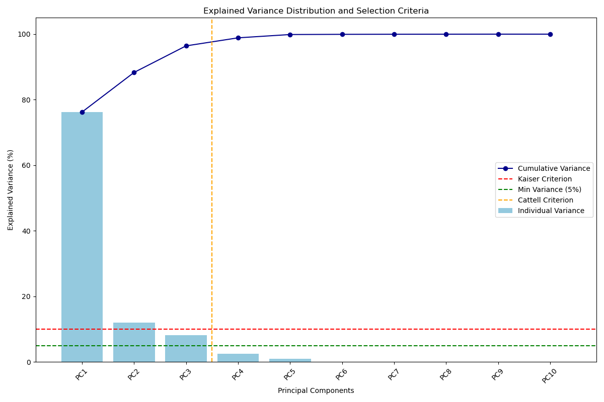
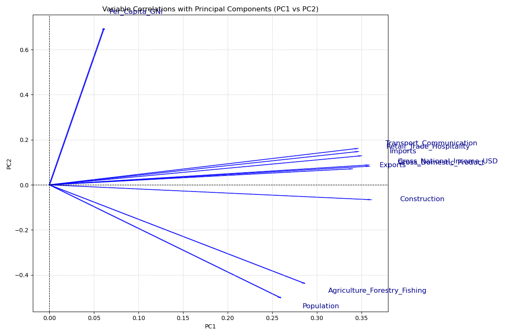
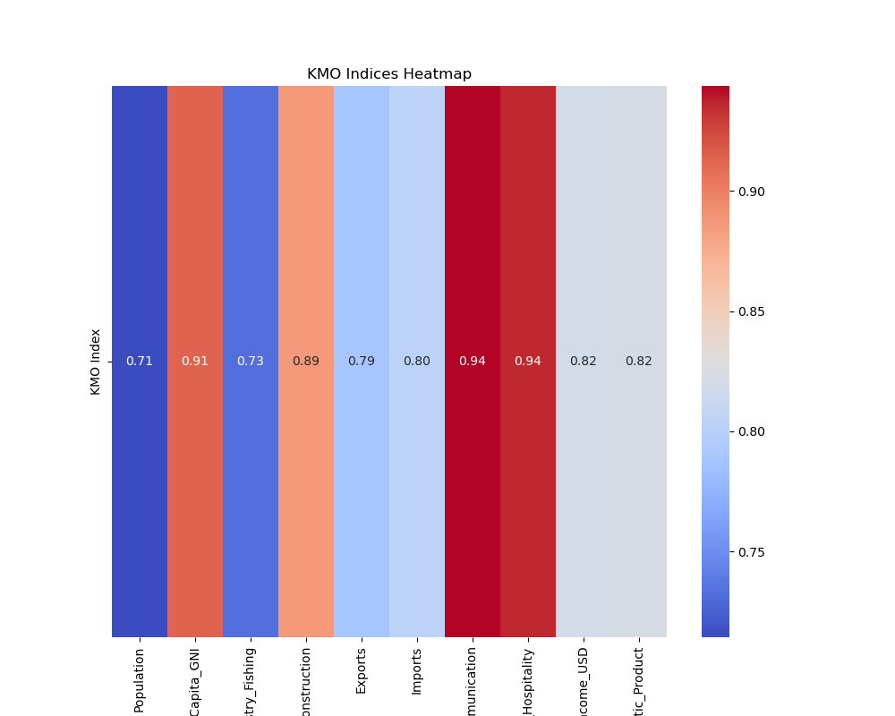
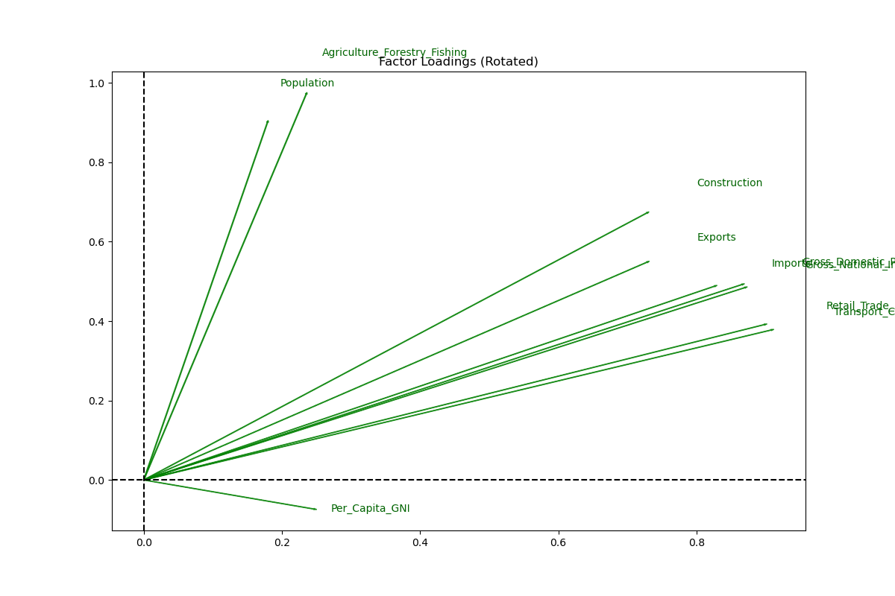

# Global Economic Analysis (PCA & Factor Analysis)

## Description
This project focuses on the analysis of the global economy for the year 2021. Using **Principal Component Analysis (PCA)** and **Factor Analysis (FA)**, we explored a dataset of various economic indicators to reduce data complexity and identify the latent structures driving global economic performance.

### Key Features
* **Dimensionality Reduction**: Simplified 10 original variables into 2 main components that capture approximately 88% of the total variance.
* **Statistical Rigor**: Applied **Bartlett’s Test of Sphericity** and **KMO Indices** to ensure the data was suitable for factor-based models.
* **Rotated Interpretability**: Employed **Varimax Rotation** to clearly define economic factors, such as general economic size versus primary sector dependence.

---

## 📊 Visuals
To understand the results of this pipeline, the following visualizations generated in the `output/` folder are recommended:

### 1. Selection Criteria (Scree Plot)
The Scree Plot helps determine the number of significant components to keep based on the Kaiser and Cattell criteria.

### 2. Variable Correlations
This plot illustrates how variables like GDP, GNI, and Exports are strongly correlated and contribute to the first principal component.

### 3. Data Adequacy (KMO)
The KMO heatmap confirms that the relationships between variables are strong enough to justify dimensionality reduction.

### 4. Factor Loadings (Rotated)
This visualization shows the final factors after Varimax rotation, separating general economic activity from the primary sector.

---

### Project Structure
* `main.py`: The entry point that orchestrates the data loading and analysis modules.
* `utils.py`: Handles data cleaning (mean imputation for missing values) and standardization using `StandardScaler`.
* `pca_analysis.py`: Executes the PCA algorithm and generates variance, loadings, and contribution tables.
* `factor_analysis.py`: Performs Factor Analysis, including rotation and statistical validation tests.

---

## 🔍 Results Summary
* **Model Validation**: Bartlett's test (p-value: 0.0) and KMO scores (all > 0.7) confirmed the model's validity for factor analysis.
* **Factor 1 (Economic Size)**: Strongly associated with GDP, GNI, and international trade.
* **Factor 2 (Primary Sector/Demographics)**: Primarily defined by Population and the Agriculture/Forestry/Fishing sector.
* **Information Retention**: The analysis effectively reduced the dataset while preserving approximately 88.31% of the initial information through the first two components.
